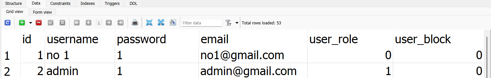
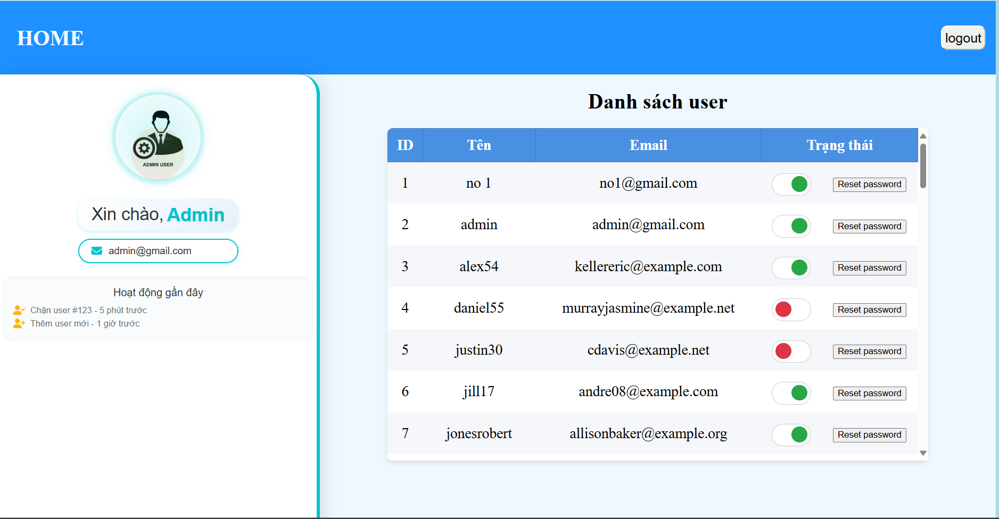
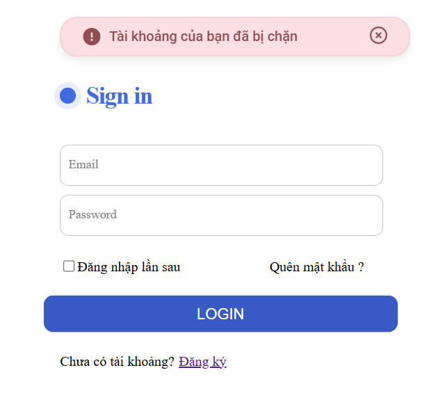
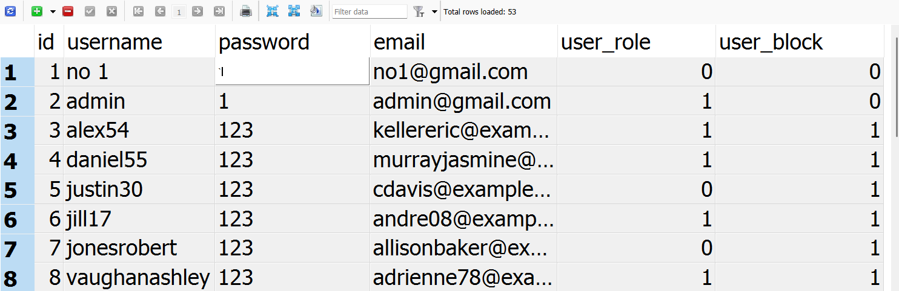

### Thêm chức năng phân quyền user và admin

- Thêm thuộc tính user_role: 1 là admin, 0 là user
  
- Thêm thuộc tính user_block:

  - admin có quyền cấm user và user sẽ không thể đăng nhập nếu bị khóa
    - GIao diện admin: trong khung trạng thái nếu đỏ là bị chặn xanh là không bị chặn, admin có thể thao tác trực tiếp trên khung trạng thái để thay đổi

      
    - User bị chặn

      
  - Thêm chức năng reset password cho user và password mặc định là 123 khi được reset
  - 
