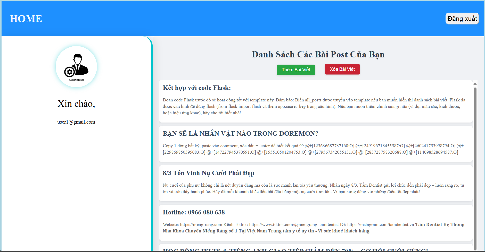

### 1. Thêm chức năng đăng bài (post) cho user:

- user thực hiện bấm vào thêm bài viết

  
- User thêm tiêu đề và nội dung cho bài đăng

  

### 2. Thêm chức năng xóa bài đăng cho user 

- User thực hiện bấm xóa bài viết

  
- Chọn các bài cần xóa và bấm xác nhận xóa

  
- Bấm xác nhận xóa để xóa

  
